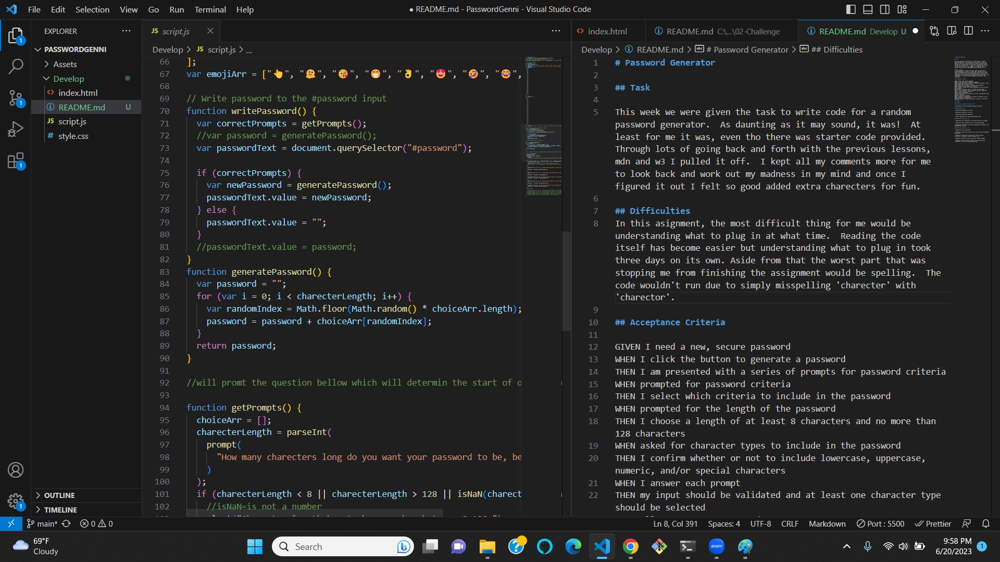
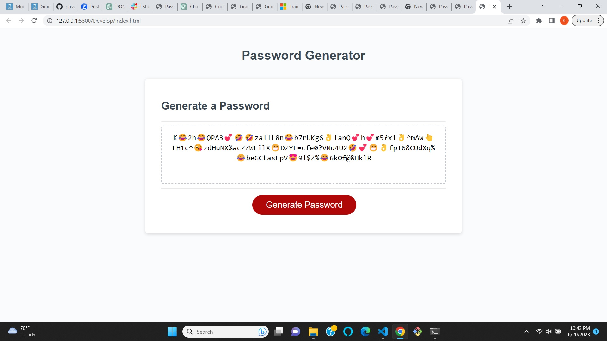

# Password Generator

## Task

This week we were given the task to write code for a random password generator. As daunting as it may sound, it was! At least for me it was, even tho there was starter code provided. Through lots of going back and forth with the previous lessons, mdn and w3 I pulled it off. I kept all my comments more for me to look back and work out my madness in my mind and once I figured it out I felt so good added extra charecters for fun.

## Difficulties

In this asignment, the most difficult thing for me would be understanding what to plug in at what time. Reading the code itself has become easier but understanding what to plug in took three days on its own. Aside from that the worst part that was stopping me from finishing the assignment would be spelling. The code wouldn't run due to simply misspelling 'charecter' with 'charector'.

## Acceptance Criteria

GIVEN I need a new, secure password
WHEN I click the button to generate a password
THEN I am presented with a series of prompts for password criteria
WHEN prompted for password criteria
THEN I select which criteria to include in the password
WHEN prompted for the length of the password
THEN I choose a length of at least 8 characters and no more than 128 characters
WHEN asked for character types to include in the password
THEN I confirm whether or not to include lowercase, uppercase, numeric, and/or special characters
WHEN I answer each prompt
THEN my input should be validated and at least one character type should be selected
WHEN all prompts are answered
THEN a password is generated that matches the selected criteria
WHEN the password is generated
THEN the password is either displayed in an alert or written to the page

## Grading

### Technical Acceptance Criteria: 40%

- Satisfies all of the preceding acceptance criteria.

### Deployment: 32%

- Application deployed at live URL.

- Application loads with no errors.

- Application GitHub URL submitted.

- GitHub repository that contains application code.

### Application Quality: 15%

- Application user experience is intuitive and easy to navigate.

- Application user interface style is clean and polished.

- Application resembles the mock-up functionality provided in the Challenge instructions.

### Repository Quality: 13%

- Repository has a unique name.

- Repository follows best practices for file structure and naming conventions.

- Repository follows best practices for class/id naming conventions, indentation, quality comments, etc.

- Repository contains multiple descriptive commit messages.

- Repository contains quality readme file with description, screenshot, and link to deployed application.

### Link to Deployed App.

(Click for Deployed App)[http://127.0.0.1:5500/Develop/index.html]
(Click for GitHub)[https://github.com/Kenlau94/PasswordGenni]

### ScreenShot

